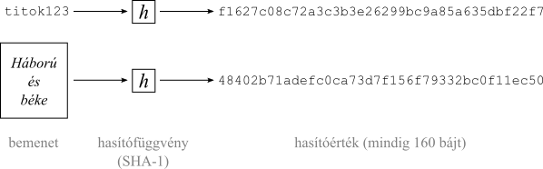
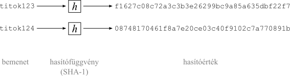
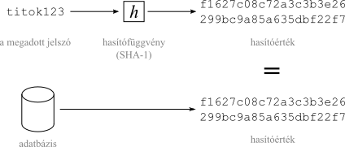
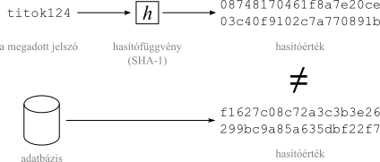

Felhasználói jelszavak biztonságos tárolása
===========================================

A sajtóban gyakran olvashatunk arról, hogy rosszindulatú támadók megszerezték nagyobb cégek (pl. ..., ... és ...) felhasználó-adatbázisát, és nyilvánosságra hozták az e-mail címeket és a hozzájuk tartozó jelszavakat. Egy ideális világban, ahol mindenki minden webhelyhez más jelszót használna, ez nem jelentene problémát, a közzétett jelszavak teljesen értéktelenek lennének. Legtöbbünk azonban annyi jelszóval védett szolgáltatást használ, hogy képtelenség lenne mindegyikhez egy-egy biztonságos, egyedi jelszót fejben tartani. A jelszókezelő programok (pl. a KeePass) erre jó megoldást jelentenek, de megfelelő használatuk olyan körülményes, hogy ezt az átlagfelhasználóktól nem várhatjuk el reálisan. Így ma szinte mindenki ugyanazt a jelszót használja újra meg újra, amikor weboldalakon regisztrál. Teljes webes jelenlétük (e-mail fiókok, közösségi oldalak, internetbank) biztonsága múlik azon, hogy ez az egy jelszó titokban marad-e.

Amikor valaki egy általunk írt webes rendszerben regisztrál, a jelszó beírásával egyik legfontosabb titkát bízza ránk. Fejlesztőként kötelességünk gondoskodni arról, hogy erre a titokra még akkor se derülhessen fény, ha valaki feltöri a szerverünket, és megszerzi a felhasználói adatokat tartalmazó adatbázistáblát. Ez, bár elsőre lehetetlennek tűnik, egyáltalán nem nehéz, módszere sok-sok éve ismert, és minden fejlesztőnek érdemes ismernie.

Kriptográfiai hasítófüggvények
------------------------------

Ehhez először ismerkedjünk meg az ún. **kriptográfiai hasítófüggvényekkel** (*cryptographic hash functions*). Ezek olyan algoritmusok, amelyek tetszőleges hosszúságú bemenetből fix hosszúságú, pl. 128-bites "lenyomatot", **hasítóértéket** (*hash*) képeznek. Egy jó hasítófüggvény nagyon megnehezíti:

- a bemenet módosítását úgy, hogy a hasítóérték ugyanaz maradjon
- megadott hasítóérték alapján a hozzá tartozó bemenet kikövetkeztetését
- két olyan üzenet létrehozását, melyeknek ugyanaz a hasítóértéke.

A jó hasítófüggvényekben a bemenet kis módosítása "lavinaeffektust" okoz: két hasonló bemenet hasítóértéke nagyon eltérő lesz.

*1. ábra: A hasítóérték a bemenet méretétől függetlenül mindig ugyanakkora*

*2. ábra: Lavinaeffektus - a bemenet kis változása a kimenetet jelentősen megváltoztatja*

A hasítófüggvényeket eredetileg nagy méretű fájlok **integritásellenőrzésére** használták, ehhez fontos volt, hogy az algoritmus alacsony processzor- és memóriahasználattal működjön. Nyílt forráskódú szoftverek letöltésénél például gyakran megadják a letöltött fájl mellett annak valamilyen ismert függvény szerinti hasítóértékét is. Ha letöltés után mi magunk is kiszámítjuk a fájl hasítóértékét, és látjuk, hogy az eltér a honlapon megadottól, igen valószínű, hogy a letöltött telepítőcsomag az átvitel közben megsérült, és a letöltést újra kell indítanunk.

Elterjedt hasítófüggvény például az MD5 (Message Digest Algorithm 5) és az SHA-1 (Secure Hash Algorithm 1).

A fentiek szerint tehát adott hasítóértékhez lehetetlenül nehéz megtalálni egy hozzá tartozó bemenetet. A "lehetetlenül nehéz" pontosabban azt jelenti, hogy csak úgy lehetséges, hogy az összes lehetséges bemenetet elkezdjük végigpróbálni, kiszámítjuk a hasítóértéküket, és figyeljük, hogy ez megegyezik-e a vizsgált hasítóértékkel. A hasítóértékből valamilyen egyszerűbb módszerrel visszakövetkeztetni elvileg lehetetlen.

Egyszerű jelszótárolás hasítófüggvénnyel
----------------------------------------

Ezt a tulajdonságot kihasználva kezdték a hasítófüggvényeket **jelszóellenőrzésre** használni. Az ötlet az, hogy a regisztráció során a jelszónak csak a hasítóértékét tároljuk az adatbázisban, magát a jelszót a rendszer eldobja. Belépésnél szintén kiszámítjuk a megadott jelszó hasítóértékét, amelyet összehasonlítunk az adatbázisban tárolt értékkel. Ha a két érték egyezik, a megadott jelszó helyes.

*3. ábra: Jelszótárolás egyszerű hasítófüggvénnyel - regisztráció*

*4. ábra: Jelszótárolás egyszerű hasítófüggvénnyel - sikeres belépés*

*5. ábra: Jelszótárolás egyszerű hasítófüggvénnyel - sikertelen belépés*

Szivárványtáblák
----------------

Azonban ahogy a számítógépek egyre gyorsabbak lettek, gazdaságossá vált a lehetséges bemenetek és hozzájuk tartozó hasítóértékek tömeges előszámítása. Ha vesszük az értelmezési tartomány egy kisebb részhalmazát, pl. az angol ábécé kisbetűiből és számokból álló, max. 10 karakteres szavakat, és ezeknek rendre kiszámoljuk és tároljuk a hasítóértékét, úgynevezett **szivárványtáblát** kapunk. Ennek segítségével már könnyen elvégezhető a fordított irányú átalakítás is, vagyis egy hasítóértéket véve megkereshető a táblázatban a hozzá tartozó jelszó.

(4. ábra: Jelszótörés szivárványtábla segítségével)

Védekezés a szivárványtáblás támadás ellen
------------------------------------------

A szivárványtáblás támadások ellen a bemenet ún. **sózásával** (*salting*) védekezhetünk. A jelszóhoz egy felhasználónként egyedi, hosszú, véletlenszerű értéket - **sót** (*salt*) - fűzünk, és az így kapott hosszabb szöveg hasítóértékét és a sót tároljuk az adatbázisban. Így olyan hosszú és bonyolult bemenetet állítottunk elő, amelynek feltöréséhez lehetetlenül nagy szivárványtáblára lenne szükség.

(ábra: Jelszótárolás sózással - regisztráció)
(ábra: Jelszótárolás sózással - sikeres belépés)
(ábra: Jelszótárolás sózással - sikertelen belépés)

Sózott jelszavak feltörése
--------------------------

Sajnos még mindig nem értünk a történetünk végére. A nagyon gyors párhuzamos számításokat lehetővé tevő grafikus processzorok (GPU) elterjedésével még a sózott jelszavak feltörése is kivitelezhetővé vált egyszerű szisztematikus próbálkozással - a só ugyanis nem titkos, csak az előtte levő részt kell variálni! A rosszindulatú támadók dolgát kifejezetten megkönnyíti, hogy a legelterjedtebb hasítófüggvények (MD5 és SHA-változatok) nagyon jó teljesítményűek: egy mai videókártya másodpercenként több mint egymilliárd SHA-1 hasítóérték kiszámítására képes.

A ma ismert legjobb megoldás
----------------------------

Ezt a problémát úgy oldhatjuk meg, hogy szándékosan erőforrásigényesre tervezzük a hasítófüggvényünket. Jelenleg többféle ilyen függvény közül is választhatunk. A legismertebb ezek közül a **bcrypt**, a legtöbb biztonsági szakértő ezt ajánlja jelszótároláshoz. Ennek a szöveges bemeneten kívül egy **lassúsági faktort** is meg kell adnunk, amellyel az erőforrásigényességet igényeink szerint szabályozhatjuk. Az algoritmus másik előnye, hogy a legtöbb implementációja a sóképzést is magában foglalja, és sót a kimenethez hozzáfűzi. Az érthetőség kedvéért vizsgáljuk meg egy bcrypt hasítóérték felépítését:

    $2a$10$N9qo8uLOickgx2ZMRZoMyeIjZAgcfl7p92ldGxad68LJZdL17lhWy
                                 \-- hasítóérték
           \-- só
        \-- lassúsági faktor
     \-- bcrypt algoritmus azonosítója

Az alábbi ábrákon így a jelszótárolás ma ismert legbiztonságosabb, ajánlott módszere látható.

(ábra: Jelszótárolás bcrypt algoritmussal - regisztráció)
(ábra: Jelszótárolás bcrypt algoritmussal - sikeres belépés)
(ábra: Jelszótárolás bcrypt algoritmussal - sikertelen belépés)
